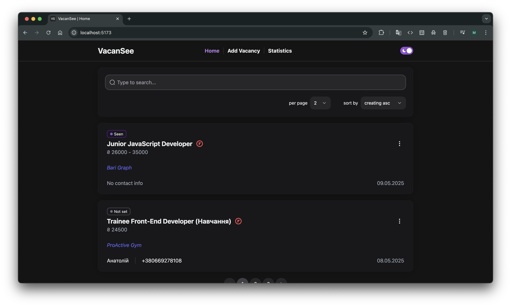
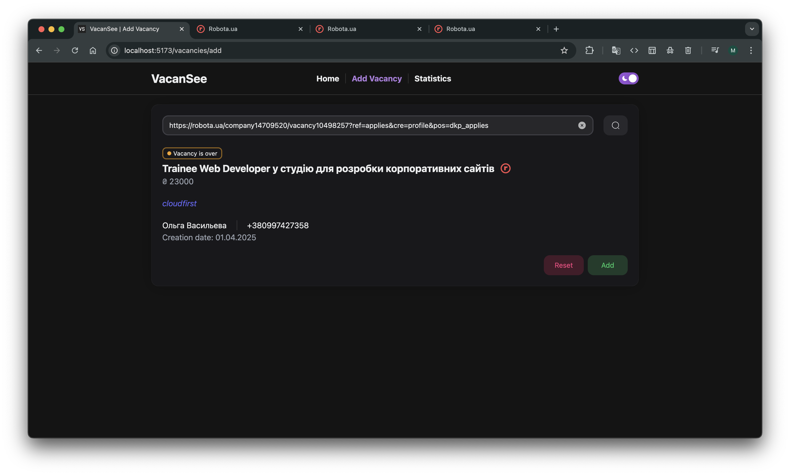
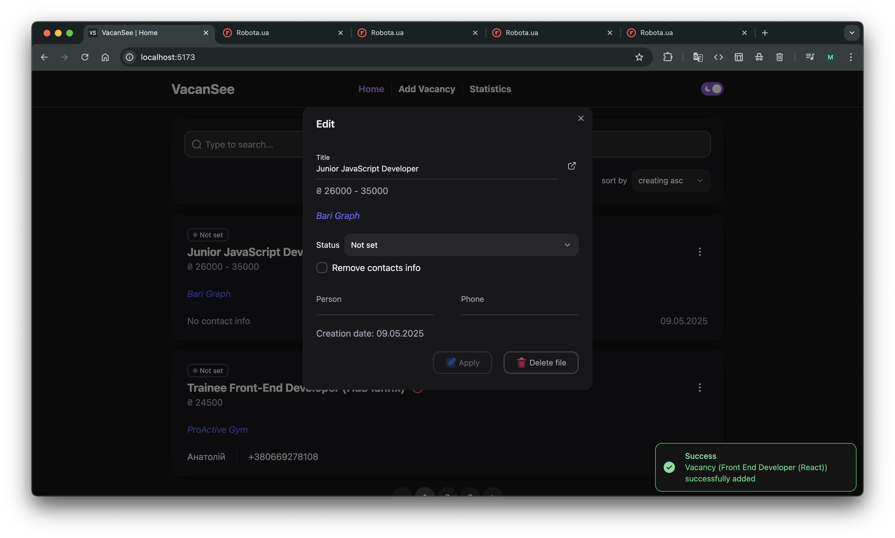
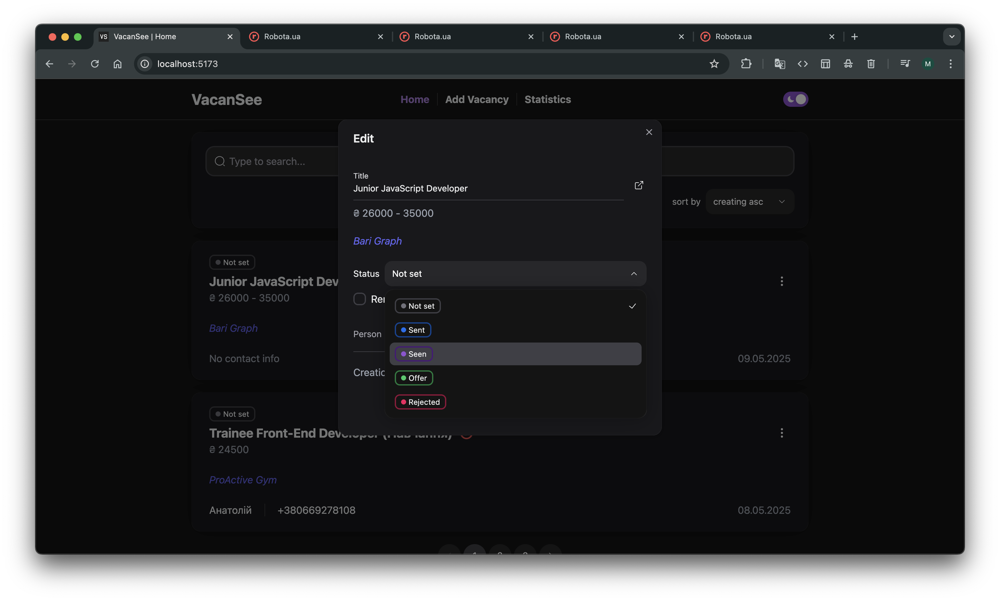
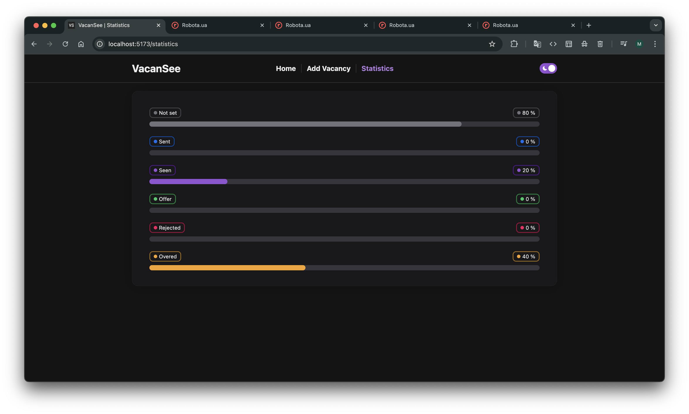

# VacanSee

**VacanSee** is a web app for tracking job vacancies. It works like a ToDo list, but instead of tasks, you manage job vacancy cards. You can add jobs via a link (currently supports robota.ua), edit details, filter, delete, and view vacancy statistics.



## 🔧 Tech Stack

### 🖥️ Frontend
- [Vite](https://vitejs.dev/)
- [React](https://reactjs.org/)
- [TypeScript](https://www.typescriptlang.org/)
- `useState`, `useEffect`, `useCallback`, etc.
- [Zustand](https://zustand-demo.pmnd.rs/) — state management
- [Lodash](https://lodash.com/)
- [Ant Design](https://ant.design/) — icons
- [HeroUI](https://heroi.com/) — UI components

### 🌐 Backend (Mock)
- [JSON Server](https://github.com/typicode/json-server) — mock REST API
  > _Note: JSON Server follows basic REST principles (routes, methods, resource structure, filtering), but is not a fully RESTful backend with business logic._

### 🗃️ Database Structure (db.json)
```json
{
  "vacancies": []
}
```

## 🚀 Features

- 🌗 Light/Dark theme toggle
- 🔍 Search (with debounce)
- 📑 Pagination
- 🗂️ Sorting and filtering
- ➕ Add vacancy by link (robota.ua)
- ✏️ Edit vacancy: status, contact, dates, etc.
- 🗑️ Delete vacancy
- 📊 Vacancy statistics by status
- 🔔 Toast notifications on actions
- 🧭 Routing: `/`, `/add-vacancy`, `/statistics`

## 📦 Getting Started

### 1. Clone the repository
```bash
git clone https://github.com/MishaDenisenko/react-vacancy-list.git
cd react-vacancy-list
npm install
```

### 2. Start JSON Server
```bash
npx json-server --watch db.json --port 3000
```

### 3. Start the React App
```bash
npm run dev
```

## 📌 Usage

1. Go to **Add Vacancy**
2. Paste a robota.ua job URL and click 🔍
3. Data is parsed and previewed automatically
4. Save the vacancy to the list
5. Go to **Statistics** to track application statuses

## 📷 Screenshots








## 🗺️ Roadmap

- Add support for more job platforms (hh.ua, work.ua, etc.)
- Manual vacancy creation form
- Server-side storage with user authentication
- Mobile responsive layout
